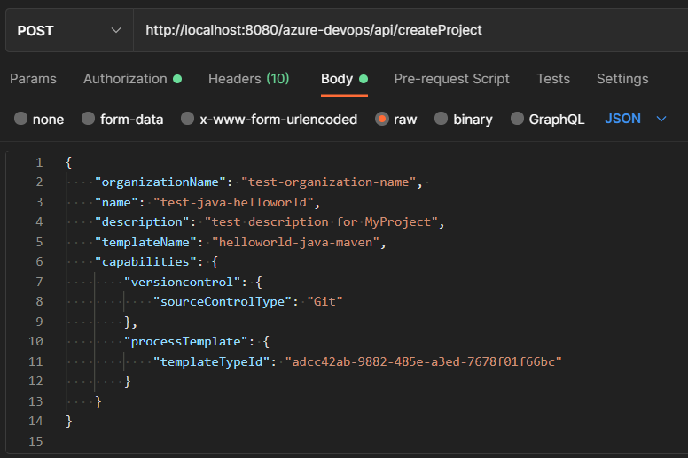
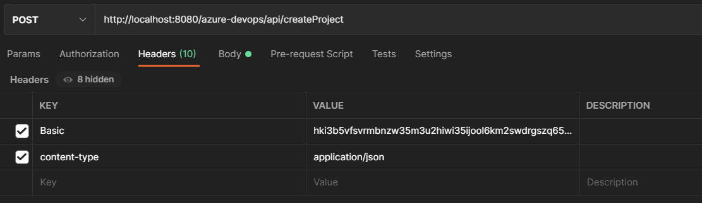

# poc-azure-devops-automation

## Introduction 
 The poc-azure-devops-automation project has the function of creating a project in Azure DevOps through a payload and basic authentication.
 The poc project has the power to create the repository, commit the sample code of Java, create pipelines (build, PR, Sonar) and branch policy, all at once.

## Build and Test
1. After run project, send a POST request to: http://localhost:8080/azure-devops/api/createProject
    
    with the following Payload:

```json
{
    "organizationName": "test-organization-name", 
    "name": "test-java-helloworld",
    "description": "test description for MyProject",
    "templateName": "helloworld-java-maven",
    "capabilities": {
        "versioncontrol": {
            "sourceControlType": "Git"
        },
        "processTemplate": {
            "templateTypeId": "adcc42ab-9882-485e-a3ed-7678f01f66bc"
        }
    }
}
```



    1. organization-name: name of the organization that must be created before creating the project
    2. name: name of the project
    3. templateName: name of the desired template(in our case it will be helloworld-java-maven)
    4. templateTypeId: project template id (Agile, Scrum, CMMI)
        1. Scrum ==> 6b724908-ef14-45cf-84f8-768b5384da45
        2. CMMI ==> 27450541-8e31-4150-9947-dc59f998fc01
        3. Agile ==> adcc42ab-9882-485e-a3ed-7678f01f66bc

## Authentication
1. send the "Basic" field in the header, with the [Personal Token](https://docs.microsoft.com/en-us/azure/devops/organizations/accounts/use-personal-access-tokens-to-authenticate?view=azure-devops&tabs=preview-page) as the value of the "Basic" field
    1. "Basic": "PERSONAL_TOKEN"
    2. "content-type": "application/json"
    

    
    